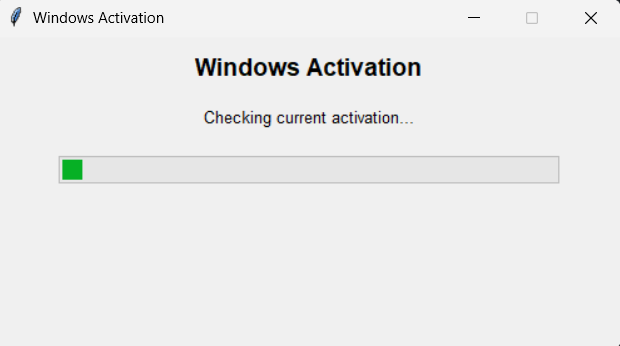
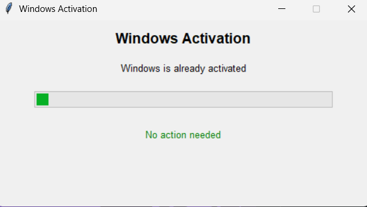

# Windows Free Activator

Open the ignite.exe 

its gonna ask for admin because its making changes to your pc (obviously)

its going to load then after should just take like 3 seconds and then tell you to restart if it fails itll have you manually input it by just hitting 1 

very simple but i just wanted to automate it honestly cause my friend had a issue setting it up somehow

# Screenshots

i have windows already from using this command so it shows that i already have it ion know why i added this  feture but shit why not freewill and shit
